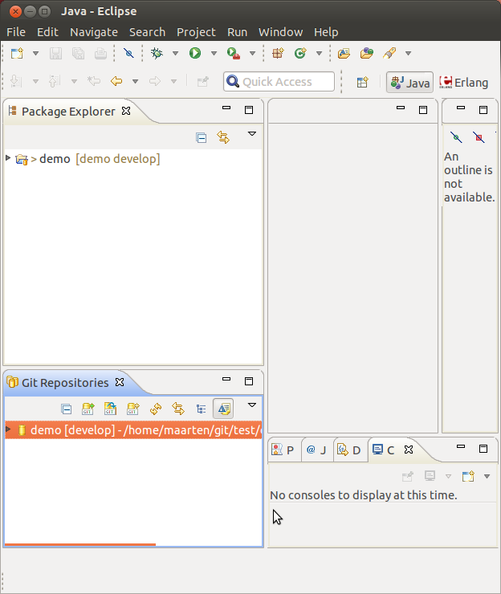
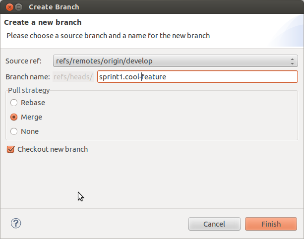
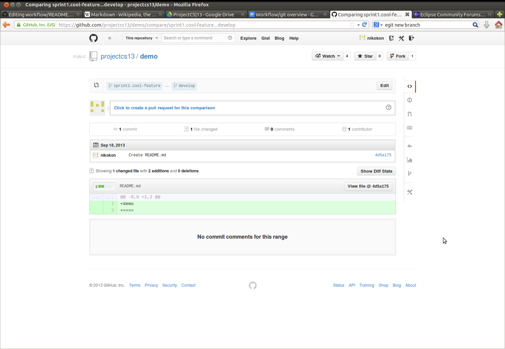
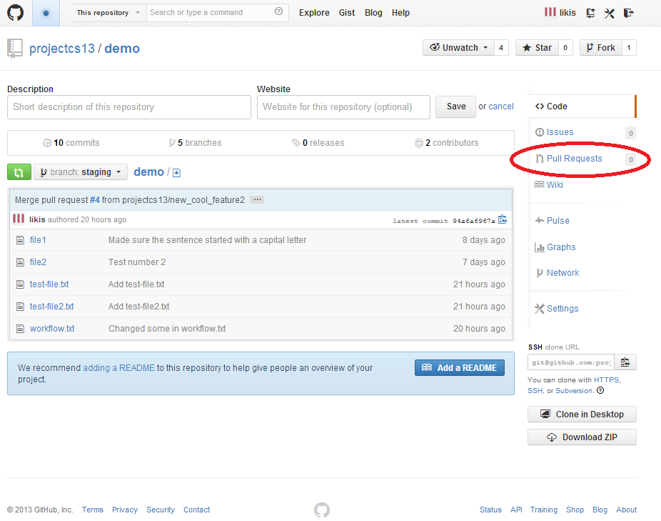
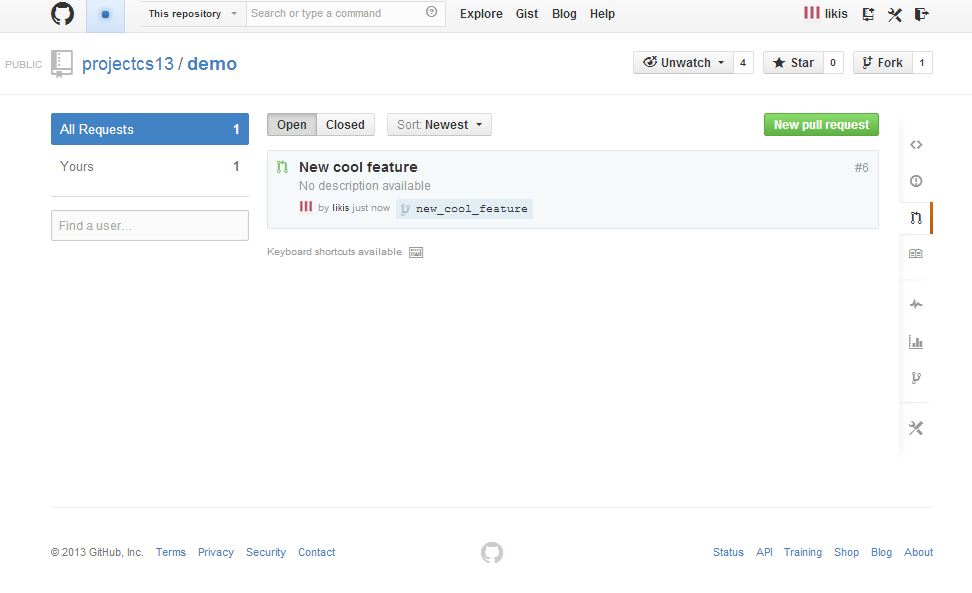
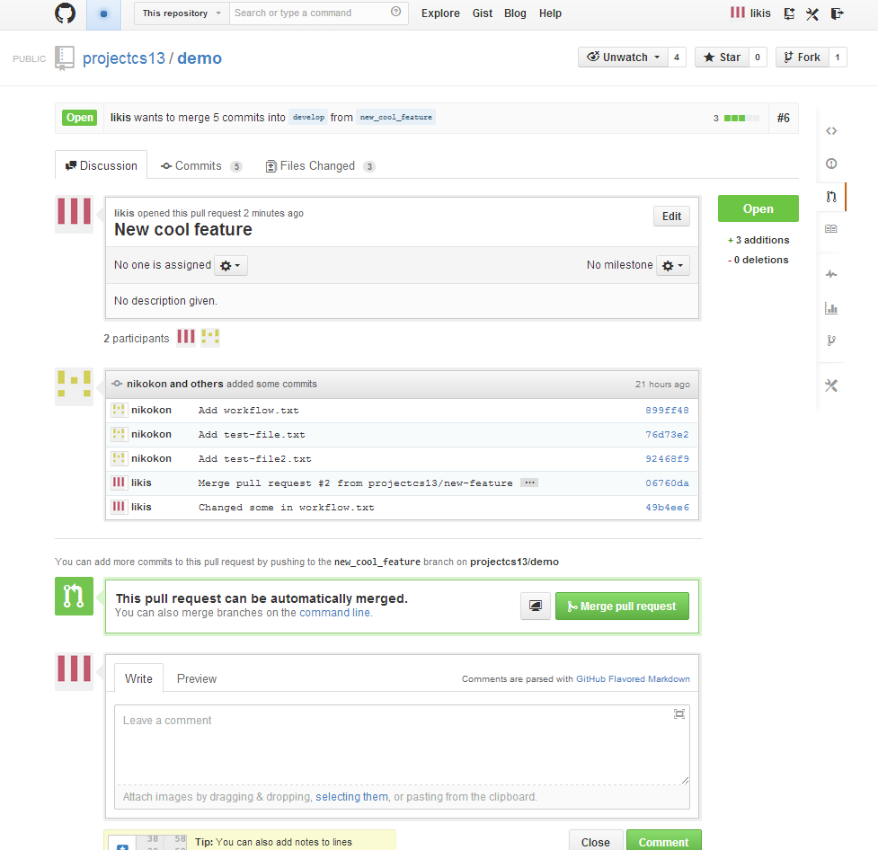
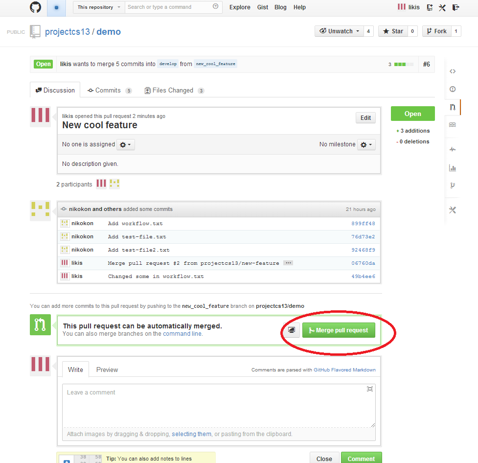

Workflow
========

Guides and ideas of how we should use Github

Overview
========

Our repository will have three main branches: master, release and develop. 
You should never push any commits to these branches directly. 
Instead whenever you add a feature you create a new branch for this feature. 
Then, when you're done with the feature, you create a pull-request of this 
new branch in to develop. This is done using the Github homepage.

* master
* release
* develop
* sprintX.Y

Whenever you start working on a new feature, you create a new branch to work on.
The naming-convention of this branch is sprintX.Y where X is replaced by the current sprint
and Y is replaced by the new feature.

The basic workflow is comprised of the following steps:

* clone from github 
* create a new branch locally to work on 
* push to github when the branch is ready for review 
* create a pull request from branch to develop
* repeat

Workflow in eclipse
===================

The following guide is supposed to explain how we work with the explained workflow in Eclipse.
You are pressumed to have installed the eGit plugin in eclipse.

It's the beginning of a sprint... Where do I start, you ask?
Well you want a fresh clone of the develop branch to continue work on.
In Eclipse, do the following steps:

file > import… > git > projects from git > URI > {the git address}

choose only the develop branch and keep clicking next in the following pop-ups.
When asked for project setup, just choose general project

You will now have the project in the package explorer in eclipse. 

The text within brackets to the right of your project corresponds to [Repository Current_Branch].
Before you start working, you want to create a new branch for the feature you are implementing.

To do this, right click on your repository in the git view and choose switch to > new branch...

This is your working branch. For more info of how to use git in your work (commit, add etc.), read the manual.

Once you are ready for code review, you need to push your branch up to github.
To do this you simply right-click on your repository in the git view and choose "push to upstream"

Now your branch is on github and you want someone to review it and merge it with the develop branch.
Goto to the repository on github and choose pull request > create pull request.
Make sure the pull request you create concerns YOUR branch and develop

Then click “send pull request”!
Now you are done!

Code Review
===========

Now you have made a pull request do the develop branch
and your code is up for review. It needs to be reviewed
and accepted before it is merged to develop.

Review Code
-----------
Check the Scrum boards for some code to review. Now you
go to the <main> repository and click on the
"Pull Requests" tab.

You are can now see the pull requests that are open.
Find the pull request that corresponds to the code that
is waiting to be reviewed that you found on the scrum
board.

In this pull request you should find all the necessary
information about the code that is up for review. You
can make comments and ask for things to be changed.

When your review is done and the pull request passed
then you can click the Merge Pull request button and make
sure that is merges from a SprintX.Y branch to the develop
branch.

